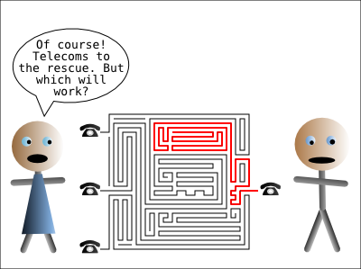

While waiting to be connected to my new ISP I was forced to use a 3G dongle for
my main Internet connection. Yikes you say! Well it's not entirely crap, I get
about 2M and ssh is mostly usable. It's like having a cable modem in 2000. As a
side note [giffgaff](http://giffgaff.com/) make this sort of thing really quite
easy (and cheap). Anyway while browsing I noticed the usual crap low res images
that appear when surfing on mobile phones, so I decided to do some investigation
into what was going on. It turns out to just be fairly straightforward, all web
traffic is just transparently proxied. So all that happens is a simple
JavaScript injection.

Say there is a simple website with the following HTML:

```
<html>
<head><title>Test</title></head>
<body></body>
</html>
```

When I load that file I actually get the following:

```
<html><script src="http://1.2.3.4/bmi-int-js/bmi.js" language="javascript"></script>
<head><title>Test</title></head> <body></body> </html><script language="javascript">
<!--bmi_SafeAddOnload(bmi_load,"bmi_orig_img",0);//-->
</script>
```

Yikes was my first reaction, bmi.js was nice and unreadable, however if you
reformat it a bit it's mostly readable, it's on
[pastebin](http://pastebin.com/Ht32CTDS) if you're interested. As an aside 1.2.3.4
is actually a bogon network! Whois says "Address blocks listed with this contact
are withheld from general use and are only routed briefly for passive testing."
Well at least they are not using genuine allocated addresses. I'd be more
worried of the mess it left the HTML in!

After a bit of googling, it turns out it's been going on for a while, bmi is
some [bytemobile](http://www.bytemobile.com/products-applications/web.html)
product. As ever a
[stackoverflow](http://stackoverflow.com/questions/4113268/how-to-stop-javascript-injection-from-vodafone-proxy)
was most useful. It seems some operators allow you to turn it off.

- [3ghtmlabusetest.html](3ghtmlabusetest.html)
- [3ghtmlabusetest.result.html](3ghtmlabusetest.result.html)
