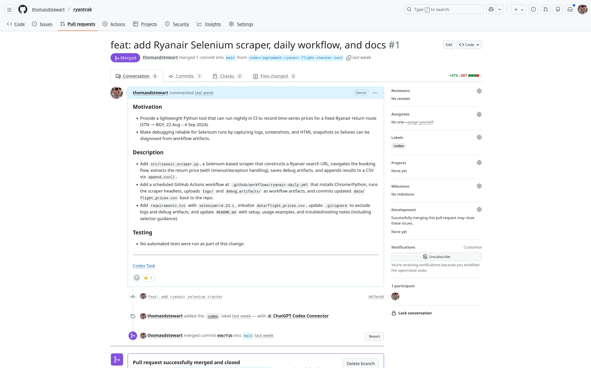

Recently I've wanted to understand more about using AI/LLM technologies to assist with code creation. I have in the past played with using chatbot style vibe coding. This is where one describes what is desired and the LLM produces an entire program. However I have found that subsequent iterations with further features hard to keep copy and pasting the entire source file, assuming a single source file is required, to be difficult. I have not really tried with in editor coding. However for the most part the "help me write this one function" to be smaller picture that I desired. So when I found out about Codex from ChatGPT I was really excited to understand how this works. For me it's the integration with GitHub that make's it really useful. In stead of having to write an ever larger perfect prompt that covers the entire aspect of the functionality, one builds up functionality one GitHub pull request at a time. I liked this concept because it's also how I develop things, eg I start small with basic functionality and then iterate. Given that each unit of work is a pull request I can inspect each change to the code base's multiple files to see if it's making the desired changes.

I'm a real believer in scratching ones own itch to really understand a thing, so I decided to try to fully implement a tool I've wanted for a while by using Codex. I've wanted something to check Ryanair prices and track them over time for sometime. What follows is a summary of this whole process.

To skip straight to the code have a look on GitHub: https://github.com/thomasdstewart/ryantrak/ or to look at the output have a look on the GitHub pages site: https://thomasdstewart.github.io/ryantrak/

The Codex web user interfaces looks like this: 

In addition each pull request also has additional details generated for me. I have also given Codex a "Custom instruction" of "Commit messages should follow conventional commit format." So a pull requests end up looking like this: 

Overall I wrote about 100 sentences over 1,100 words of prompt text, which is about two sides of A4 with size 12 font.

Each section header below is the ChatGPT summary of my prompt and below each prompt is my actual prompt, the summary ChatGPT has provided describing what it's done and then a link to the GitHub pull request. This shows the entire tool's creation from an empty repo through the 42 prompts I provided to what I'm calling version 1.0.

## Implement Ryanair flight checker tool
> I want to write a tool that can continuously check ryanair flights every day and graph the result over time. I want to use Python. I want to use Selenium. Initially to keep tings simple lets start with  London Stansted to Milan Bergamo Return 22 Aug - 4 Sept 1. My idea is that a single program run can run in a GitHub action, perform the search and record the results. I think initially just keeping the results in a csv file. Can you sketch out most of an implementation. Include updating the readme, the scraper file, the git hub actions, given it's  Selenium there will have to be a fair amount of logging and debugging.

> *  Added a Selenium-based Ryanair scraper with logging, CSV output, and debug artifact capture for the STN→BGY return search flow.
> * Added a daily GitHub Actions workflow to run the scraper, upload debug artifacts, and commit updated CSV results.
> * Documented setup, usage, workflow behavior, and troubleshooting guidance in the README.

https://github.com/thomasdstewart/ryantrak/pull/1

## Fix cookie warning before displaying results
> It looks from the debug that there is a cookie warning that needs to be clicked before the results are shown.

> * Added cookie banner acceptance handling with multiple selector fallbacks to unblock price scraping, and call it before waiting on the price element.

https://github.com/thomasdstewart/ryantrak/pull/2

## Add flake8 and pre-commit configurations
> lets fix some boiler plate in one shot. Lets a a .flake8 file with this in:
> 
> [flake8]
> max-line-length = 160
> 
> Let's get an initial .pre-commit-config.yaml, usual checks, plus python checks, also ruff, also commitlint
> 
> Let's add a github action dependabot.
> 
> Let's add a github action for Commit Lint.
> 
> Let's also a github action to lint action for flake8 and ruff.
> 
Let's also have github action to run pytest.

> * Added flake8 configuration and pre-commit hooks (including ruff and commitlint) plus commitlint settings for conventional commits.
> * Added Dependabot configuration to track GitHub Actions and pip updates.
> * Added GitHub Actions workflows for commit linting, Python linting (flake8/ruff), and pytest runs.

https://github.com/thomasdstewart/ryantrak/pull/3

## Dependabot Interlude
These next 6 pull requests were Dependabot updating versions of various things
 * https://github.com/thomasdstewart/ryantrak/pull/4
 * https://github.com/thomasdstewart/ryantrak/pull/5
 * https://github.com/thomasdstewart/ryantrak/pull/6
 * https://github.com/thomasdstewart/ryantrak/pull/7
 * https://github.com/thomasdstewart/ryantrak/pull/8
 * https://github.com/thomasdstewart/ryantrak/pull/9

## Update search year to 2026
> Can you update the year in the search from 2024 to 2026

> * Updated the default departure and return dates to 2026 for the search arguments.

https://github.com/thomasdstewart/ryantrak/pull/10

## Capture flight time in search results
> The search will return more than one flight make sure to capture the time as well.
we have depart_date and return+date, and now also flight_time. I think we need a depart_time and a return_time. It needs to capture both.

> * Replaced the single flight_time CSV field with separate depart_time and return_time columns and updated the FlightOption model accordingly.
> * Added multi-time extraction to capture outbound and return times per flight card, and wrote both values into CSV rows for each option.

https://github.com/thomasdstewart/ryantrak/pull/11

## Update GitHub Action year to 2026
> the github action uses 2024 rather than 2026 (the current year)

> * Updated the GitHub Actions scraper dates to use 2026 for the departure and return parameters.

https://github.com/thomasdstewart/ryantrak/pull/12

## Fix CSV pricing extraction issue
> There seems to be a problem extracting the pricing values as the CSV files gets "missing-price"

> * Added normalized price text extraction that checks element text plus common attributes, reducing false “missing-price” results when prices are present but not in visible text nodes.
> * Expanded price selectors and applied page-level price extraction for single-price flows, marking missing prices only when no price text is found.

https://github.com/thomasdstewart/ryantrak/pull/13

## Add pytest tests for data extraction
> I want to implement some more tests. Ideally some quick ones in pytest that can run and fail fast without Selenium. The later tests that run Selenium against a downloaded html page allowing offline checking that data extraction works and returns the correct values. We can use the existing search to verify this.

> * Added pytest to dependencies and test harness/fixture scaffolding for offline HTML validation of flight cards.
> * Added unit tests for URL building, text normalization, and CSV writing plus a Selenium offline extraction test for flight cards.

https://github.com/thomasdstewart/ryantrak/pull/14

## Fix price extraction issue
> There seems to be a problem with the price extraction still. The CVS files says "missing-price".

> * Added regex-based price extraction fallback and body-text fallback to reduce missing-price results when selectors fail.
> * Added unit coverage for the new price parsing helper.

https://github.com/thomasdstewart/ryantrak/pull/15

## Update CSV output format and fix logic
> Sorry I make a mistake, can you add a time field after the date.

> * Added the requested time column to the CSV schema and populated it from the outbound flight time field.

https://github.com/thomasdstewart/ryantrak/pull/16

## Update flight dates file with extra rows
> Let's update the flight dates file to have 2 extra rows. One with 1 day earlier and 1 with 1 day later.

> * Added one-day earlier and later entries around the existing flight date row in the flight dates CSV.

https://github.com/thomasdstewart/ryantrak/pull/21

## Parameterize input dates from CSV
> Great start, I also want the airports as parameters too.

> * Added origin/destination columns to the date configuration CSV so routes are parameterized alongside dates.
> * Updated the workflow to read origin and destination per CSV row when invoking the scraper.
> * Documented the updated CSV schema in the README.

https://github.com/thomasdstewart/ryantrak/pull/20

## Fix incorrect origin and destination
> It looks like the origin,destination are not being set correctly. For the rows wit return flight they are not correct, eg they need to be swapped.

> * Swap origin/destination values for return-leg CSV rows so the return flights are labeled correctly.

https://github.com/thomasdstewart/ryantrak/pull/19

## Fix issue with missing return flights
> This is looking great. Each run returns 4 data rows that seems ok. These are the outbound fights. However the 4 return flights do not show up.

> * Added flight-date tracking for each flight card and assign return-date entries when outbound/return sets are detected so return flights are included in results.
> * Updated CSV rows to use the per-flight date when writing departure/arrival timestamps.

https://github.com/thomasdstewart/ryantrak/pull/18

## Update flight schedule columns
> Let's continue to improve. Instead of date and time columns. Let's have departure_date and arrival_date and have those contain both the date and time of the flight takes off and flight landing.

> * Replaced the CSV schema to emit combined departure_date/arrival_date values and added a formatter to build date-time strings for flight rows.
> * Updated unit test expectations to match the new combined date-time columns.
> * Refreshed the sample CSV data to align with the new header and combined date-time values.

https://github.com/thomasdstewart/ryantrak/pull/17

## Generate flight price visualization graphs
> Next I'd like to try to visualize the data. I want to track how the price of flights changes over time. So from the data/flight_prices.csv file I want to find unique flights, eg looking at orign=STN, destination=BGY, depart_date=2026-08-22T11:35, I can see that on the 2026-01-14 it was £78.62 where as it was £77.70 on the 2026-01-15. So in this case the graph would have capture/scrape date on the x axis and cost on they axis, with the data series being orign=STN, destination=BGY, depart_date=2026-08-22T11:35. I don't want to run any servers to generate them dynamically. I want to use actions to generate these graphs. I think initially these can be generated and stored in the data dir.

> * Added a charting script to generate per-route departure-time price history PNGs from flight_prices.csv.
> * Wired the daily GitHub Actions workflow to generate charts and commit the data/charts outputs alongside price data updates.
> * Documented the chart generation flow and added pandas/matplotlib dependencies.

https://github.com/thomasdstewart/ryantrak/pull/22

## Split daily Ryanair price check tasks
> Can you split out the "Daily Ryanair price check" into two please, one do run the scape and one to generate the graphs an hour later.

> * Split the daily Ryanair workflow into a dedicated scrape workflow that only commits updated price data.
> * Added a separate chart-generation workflow scheduled one hour later to update and commit charts.

https://github.com/thomasdstewart/ryantrak/pull/23

## Update query dates and clear existing data
> Can you change the query dates to 16th August to 1st Sept and 17th August to the 2nd Sept. Also clear out all the existing data I the cab results.

> * Updated the flight date pairs to 2026-08-16/2026-09-01 and 2026-08-17/2026-09-02.
> * Cleared the existing flight price results to just the header row.

https://github.com/thomasdstewart/ryantrak/pull/24

## Update chart filenames to single underscore
> Update the chart filenames to not have two consecutive underscores just one.

> * Updated chart filename generation to use a single underscore separator between slug components.

https://github.com/thomasdstewart/ryantrak/pull/25

## Delete existing chat files
> Delete the existing chat files

> * Removed the generated chart images from data/charts while keeping the directory tracked with a placeholder file.

https://github.com/thomasdstewart/ryantrak/pull/26

## Create GitHub Actions workflow for pages
> I want to use GitHub pages to have a web page that shows an index of all the various graphs. Can you create a workflow for this. I've turned on GitHub pages, so just need a workflow created.

> * Added a GitHub Pages workflow that builds a static chart index, packages chart assets, and deploys the site on the default branch.

https://github.com/thomasdstewart/ryantrak/pull/27

## Generate graphs in pages workflow
> let's generate the graphs as part of the pages workflow and remove the graph generation workflow.

> * Added Python setup, dependency install, and chart generation steps to the Pages workflow so charts are produced during the build before publishing the site.

https://github.com/thomasdstewart/ryantrak/pull/28

## Remove charts from repository
> Now that the charts are generated in the pages let's delete them from the repo. Also when the failed Scape script runs via actions it doesn't trigger the pages action.

> * Stopped tracking generated chart PNGs by ignoring data/charts/*.png so charts aren’t kept in the repo going forward.
> * Triggered the Pages workflow after the daily scrape workflow completes on the default branch, ensuring Pages builds even when the scrape workflow finishes without a push trigger.

https://github.com/thomasdstewart/ryantrak/pull/29

## Clean up project files and dependencies
> There is a bit of confusion. The search for the flight will need departure and return, which will return 2 set of flight. Then each result then has a departure and arrival for each flight. Lest go back from scratch to simplify things. When querying the website lets make flight_dates.csv use the same terms date_out and date_return. Then for each flight results use departure_date,arrival_date. This might need to update csv, tests, github workflows, python files, etc.

> * Updated the scraper search configuration to use date_out/date_return inputs while keeping per-flight results as departure_date/arrival_date, including CLI flags and URL construction.
> * Aligned the daily workflow parsing, README usage docs, and flight_dates.csv header with the new date_out/date_return naming for searches.
> * Updated unit tests to construct SearchConfig with date_out/date_return while preserving CSV expectations for departure_date/arrival_date.

https://github.com/thomasdstewart/ryantrak/pull/31

## Fix chart refresh on action run
> The pages action seems to build the charts, but they don't appear to contain the updates charts, eg it seems they are not refreshed when the action runs.

> * Pinned the Pages workflow checkout to the default branch so chart generation uses the latest committed CSV data when the workflow runs after the daily scrape.

https://github.com/thomasdstewart/ryantrak/pull/30

## Update GitHub Actions for Hugo site
> The GitHub actions workflow for pages needs to be updated for the new Hugo site. It needs to run Hugo and publish the output to pages.

> * Updated the Pages workflow triggers and build steps to generate charts into the Hugo static folder, run Hugo, and publish the public output to Pages.

https://github.com/thomasdstewart/ryantrak/pull/33

## Improve web interface with Hugo
> I think I'd like a nicer web interface. Let's use Hugo and a simple theme. Also I want some sort of drop down to limit which graphs to show.

> * Added a Hugo site with a simple theme, chart grid, and route filter dropdown plus styling and JS behavior for filtering charts.
> * Pointed chart output to site/static/charts and documented the Hugo dashboard workflow in the README.

https://github.com/thomasdstewart/ryantrak/pull/32

## Fix publish job artifact path
> There is a mistake with the pages action. It seems to run the Hugo ok as I see the Hugo output. However the publish job gives this error: "Archive artifact tar: public: Cannot open: No such file or directory" so I suspect the publish needs to be site/public maybe?

> * Updated the Pages artifact upload path to match Hugo’s output under site/public, avoiding missing directory errors during publish.

https://github.com/thomasdstewart/ryantrak/pull/35

## Fix action resolution error for pages
> I'm getting an error on the pages action: Unable to resolve action actions/setup-hugo

> * Updated the Pages workflow to use the maintained peaceiris/actions-hugo action for Hugo setup, resolving the missing actions/setup-hugo reference.

https://github.com/thomasdstewart/ryantrak/pull/34

## Update Hugo site URL
> The Hugo site URL should be https://thomasdstewart.github.io/ryantrak/ hopefully this will avoid the images/ charts giving 404 errors.

> * Updated the Hugo baseURL to the GitHub Pages site to avoid asset 404s.

https://github.com/thomasdstewart/ryantrak/pull/36

## Update collection interval and flight dates
> Let's increase the collection interval, I would like the scrape to run at, 00:00, 06:00, 12:00, 18:00, eg 4 times a day. I would also like to search for more dates. So add more rows to flight_dates.csv, add flights for the 16th and 17th date out and 1st and 2nd return, however add months before and after the current dates, eg cover April, May, June, July and September.

> * Updated the workflow schedule to run the scrape four times daily at 00:00, 06:00, 12:00, and 18:00 UTC.
> * Expanded flight_dates.csv with April, May, June, July, and September date pairs for the 16th/17th outbound and 1st/2nd return windows.

https://github.com/thomasdstewart/ryantrak/pull/37

## Add date filter dropdown
> Let's improve the hugo site. The existing dropdown to filter by route is great. Lets add a further dropdown for date.

> * Added a date filter dropdown to the chart controls in the Hugo layout alongside the existing route filter.
> * Populated the date dropdown and applied combined route/date filtering logic for the chart grid status updates.

https://github.com/thomasdstewart/ryantrak/pull/38

## Add full screen graph expansion
> I would like to be able to click each individual graph and have it expand to full screen. Also the filter by date and route should update each other, eg picking a route should update the list in date. Also when one flight is selected the result is cropped into a rectangle so most of the graph s not visible.

> * Made chart cards keyboard-accessible and added modal markup to support fullscreen expansion of individual charts.
> * Synced route/date filters so each selection refines the other before updating the visible charts.
> * Adjusted chart image sizing and added focus/modal styling to prevent cropping and improve presentation.

https://github.com/thomasdstewart/ryantrak/pull/39

## Rename Publish Hugo site to Pages
> Lets do a little clean up, rename the "Publish Hugo site to GitHub Pages" to "Pages" and rename "Daily Ryanair price scrape " to "Scrape".

> * Renamed the daily scrape workflow display name to “Scrape.”
> * Renamed the Hugo Pages workflow display name to “Pages” and updated the workflow trigger reference to “Scrape.”

https://github.com/thomasdstewart/ryantrak/pull/40

## Parallelize ryanair_scraper.py execution
> The Scrape job is taking about 20min. I think it can probably be parallelized a little. I think the ryanair_scraper.py script could be run 4 at a time. This should take the runtime down to about 5 min.

> * Parallelized the GitHub Actions scrape job to run up to four scrapes at once and merge per-run CSV outputs into the main dataset, with per-route logs/debug folders to avoid collisions.

https://github.com/thomasdstewart/ryantrak/pull/41

## Rename ryanair-daily.yml to scrape.yml
> Rename the ryanair-daily.yml to scrape.yml

> * Renamed the Ryanair daily workflow file to scrape.yml.

https://github.com/thomasdstewart/ryantrak/pull/42
