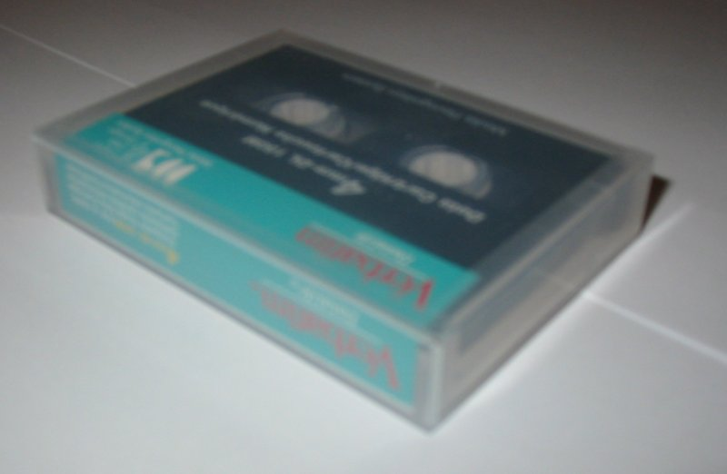
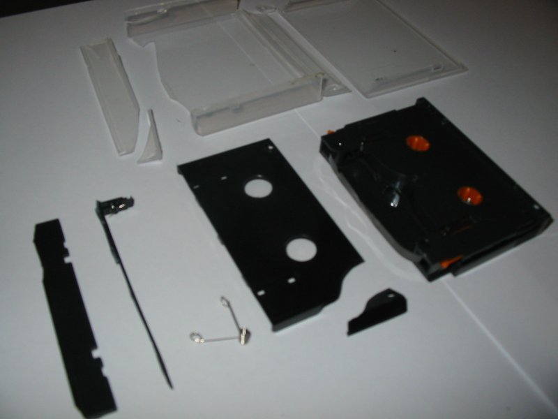
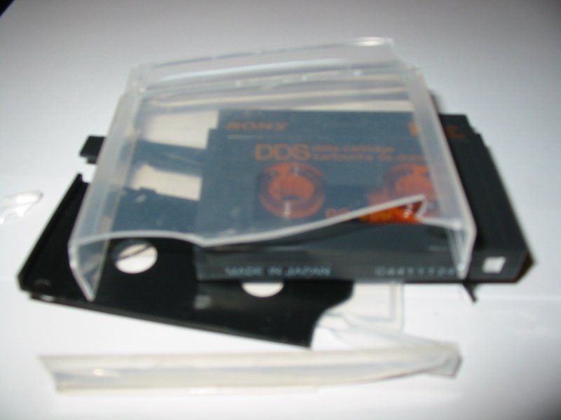
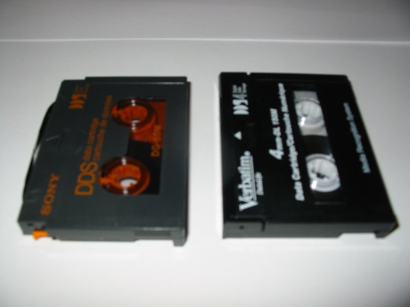

To see how hardy DDS tapes were, I decided to do some tests. I apologise for the
image quality. Anyway, on with the show.

## Before

My main test was to see how strong the cassettes actually are, so I decided to
run one over with my car. Three times. Surprisingly the only thing to break was
the case and the flap at the front, the main body stayed intact. I only rolled
over it. I think if I hit it at speed, it would be toast.

Here is a plain old DDS 4 tape, 20G native, 40G compressed:

## After

 

