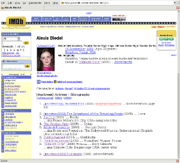
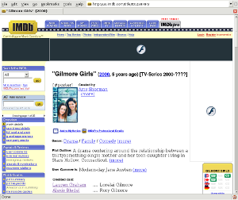
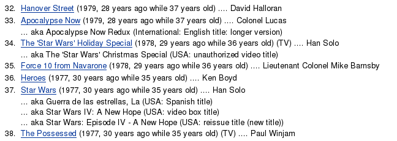

IMDB Age is a [Greasemonkey]() script
that I wrote to add age and other various info onto IMDB pages.

Specifically it
adds some details to actors or actresses pages. It adds their age, their Tropical
Zodiac Sign and their Chinese Zodiac Sign. As well as adding how many years ago
and how old they were when they made the listed films. It also adds how long ago
a film was made on a film page.

This script is not abandoned, email thomas@stewarts.org.uk if it breaks.

I have a few screenshots so you can see what it looks like.

 

It was created on 2005-03-29 but inspired sometime in 2001 and the last
modification was on 2020-12-28. And the current version is v2.14. First you need
[Greasemonkey](https://addons.mozilla.org/firefox/addon/748) installed then
install the script. It is available [locally](IMDBAge.user.js) or on the
[userscripts](http://userscripts.org/scripts/show/1060) server (down),
[greasyfork](https://greasyfork.org/scripts/2798-imdbage),
[monkeyguts](https://monkeyguts.com/code.php?id=268) (down),
[openuserjs](https://openuserjs.org/scripts/thomas_d_stewart/IMDBAge) or
[github](https://github.com/thomasdstewart/IMDBAge/raw/master/IMDBAge.user.js).

Changelog

- 2.14 fixed icon, improved getNameDates, new style fixes, reformatting
- 2.13 added https urls, removed scriptvals, fixed title pages
- 2.12 fixed adding ages to individual films and fixed old style
- 2.11 fixed date grabbing again
- 2.10 fixed date grabbing
- 2.9 fixed adding year to title with many years
- 2.8 old style working, fixed death day for new style, improved year grabbing
- 2.7 added persistent config, changed namespace
- 2.6 fixed star signs and added unicode symbols
- 2.5 fixed imdb updates
- 2.4 fixed imdb updates
- 2.3 improved year grabbing
- 2.2 updated imdb text info, formatting, added ages to individual films
- 2.1 Major changes, added signs, added config
- 1.6 Added improvement ideas from Christopher J. Madsen, Added first imdb text
  files search, Reformatting
- 1.5 Removed function enclosing while script
- 1.3 First public version
