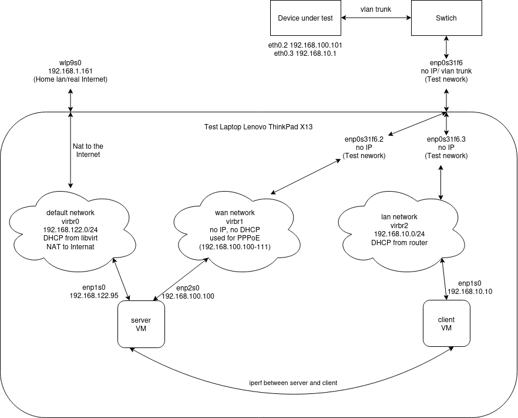

My home Internet connection is a VDSL/FTTC (fibre to the cabinet) which comes
over the telephone line into a BT master socket which has an ADSL filter and
requires a modem. The modems are now usually built into the BT Home/Smart Hub
CPE (Customer-premises equipment) but I still use a Huawei HG612 standalone
modem as I don't particularly like the CPE I was given. So I need a router to talk
PPPoE to the modem and also firewall, route and NAT my home lan traffic to the
Internet. I used a pair of Linksys WRT3200ACM devices: one as a router and
wireless access point and the other as just a wireless access point. However
while I was quite happy with them, the overall experience was not great: Ring
devices would not connect, Tapo devices would not upgrade firmware and the
overall signal quality around the house was not very good. So I upgraded to some
Aruba Mesh wireless access points, which turned out to be great. However this
left most of the functionality of the WRT3200ACM unneeded in what is quite a
large physical footprint, also I don't want to overload the device by turning my
internet router into a NAS. Thus I needed to find a replacement device that just
does the routing. Also with the new access points I also changed to a managed
network switches with vlans to allow guest wifi, an untrusted iot network, etc.
Thus the new device could just be a single port router on a stick with a single
trunk link.

My random set of requirements for the new device (in no order):

- can do the right tech networking stuff: eg PPPoE, VLANs, NAT, firewall, DHCP,
  DNS (resolver and local registration), NTP
- be as open as possible
- reasonable gui/cli: probably openwrt (as mostly everything else is rubbish and
  openwrt seems least worse)
- easy to swap and obtain new hardware in case of failure (eg Raspberry Pis are
  (used to be) available)
- easy to backup config or capture steps to configure replacement device
- no fans and no spinning rust
- serial console (eg no usb keyboard/screen for debugging)
- small, wall mountable and lower power (eg <20W)
- link and status leds
- simple to boot and work
- simple (eg I don't want virtual machine stack with 1000 things to go wrong)
- ideally multiple ports to make the setup simple (eg with a single port router
  on a stick, bootstrapping the mgmt interfaces on a vlan is harder)

I decided on a few devices, however I was unsure how each performed. The goal of
this benchmark is run iperf3 and ping from a fake client to a fake server and
thus end to end test a routers bandwidth. Once an initial set of benchmarks are
run on a virtual router the individual devices can then be tested by using
VLANs. By connecting the test host to a trunked port and adding the untagged
interfaces for the wan and lan network to the wan and lan virtual bridges the
test virtual router can be switched off and the device under test can be
benchmarked.

## Device under test

- [EdgeRouter Lite 3](https://dl.ui.com/datasheets/edgemax/EdgeRouter_DS.pdf)
  [£21.00](https://ebay.co.uk)
- [GL.iNet GL-AR150](https://www.gl-inet.com/products/gl-ar150/)
  [£21.30](https://www.amazon.co.uk/gp/product/B015CYDVG8/)
- [Linksys WRT3200ACM](https://www.linksys.com/gb/wrt3200acm-ac3200-mu-mimo-gigabit-wi-fi-router/WRT3200ACM-UK.html)
  Currently bizarrely expensive
- [Raspberry Pi 2 Model B](https://www.raspberrypi.com/products/raspberry-pi-2-model-b/)
  Obsolete
- [Raspberry Pi 3 Model B](https://www.raspberrypi.com/products/raspberry-pi-3-model-b/)
  Only not obsolete due to Pi4 shortage
- [Raspberry Pi 4 Model B](https://www.raspberrypi.com/products/raspberry-pi-4-model-b/)
  Currently unobtainable

## Benchmark tools

The two metrics I wanted to benchmark are throughput and latency. I used iperf3
for bandwidth and ping for latency. These three commands were used to get
figures for download bandwidth, upload bandwidth and latency.

```
target=192.168.122.x #server ip in default libvirt network
iperf3 -c $target -i 1 -t 60 -Z -J -R | jq .intervals[].sum.bits_per_second | while read n; do echo "$n / 1000 / 1000" | bc -l; done | datamash --sort min 1 max 1 mean 1 median 1 sstdev 1
iperf3 -c $target -i 1 -t 60 -Z -J | jq .intervals[].sum.bits_per_second | while read n; do echo "$n / 1000 / 1000" | bc -l; done | datamash --sort min 1 max 1 mean 1 median 1 sstdev 1
ping -c 60 -i 1 -n -q $target
```

After the fact it was pointed out that measuring power usage would also be
interesting, so retrospectively I used my cheap
[https://www.amazon.co.uk/gp/product/B07H1ZFVFM/](Nevsetpo Power Meter).

## Network setup

The test setup creates some networks using libvirt the three required networks
and three test virtual machines. The server virtual machine is connected to the
default network which allows the host to ssh in. It is also on a wan network
without any IP, the server runs the PPPoE process on this network, emulating the
ISP. The router virtual machine is also on the wan network and runs the PPPoE
client and connects to the server and uses the server as its router. It's also
connected to a separate lan network which it runs DHCP services for. The final
virtual machine called client it only connected to the lan network.

### Virtual router setup

In order to prove that the test network functions as expected a virtual router
was built. 

### Test router setup

When the actual devices were being tested the virtual router was turned off and
the tagged ethernet interface was added to the correct bridges that libvirt was
using. Thus allowing the test laptop to connect to the managed switch and the
devices under test were connected to the managed switch.


## Create virtual network

These are the commands I ran to create the two virtual machines and see the
virtual bridge device names which are used for the VM creation commands below.

```
for n in lan wan; do echo "<network><name>$n</name></network>" > /tmp/net.xml; sudo virsh net-define /tmp/net.xml; sudo virsh net-start $n; sudo virsh net-autostart $n; done

def=$(sudo virsh net-info default | awk '/Bridge:/{print $2}')
lan=$(sudo virsh net-info lan | awk '/Bridge:/{print $2}')
wan=$(sudo virsh net-info wan | awk '/Bridge:/{print $2}')
echo "def:$def lan:$lan wan:$wan"
```

## Setup

### Create server

Next create a new virtual machine with virt-install and inject a
[preseed file](preseed-server.cfg). It's mostly boiler plate Debian install.

```
echo "H4sIAAAAAAAAA4VUTY/TMBC991dYi5DgkHoXOC0CaSWOK0BaCS5IkRtPErOOJxpPmlar/e9M6qRNGxaqtrGdN19vxu9V3hJEAJv/uFmtbOZUAC7KSlfAeY2Rg2lARSYXKhWBtkCXKIuNcWHCeBPmgKJGjJC7wEClKcQVeChYmY4xxav7zALLmfZobF46anpDoDaIHkxQTB0kZOOIkHSBXWDaTwEbEzrj54CaudWXuVvYrOXnTFgjVQu4dSQp4MmtTuAFsCXcTaCUVmti7K0mRM48VkLFlHppfIQ5phMGs7Lz/iKzKdAM9n9EdlgjWbVYvAjNTDX0amkwWhALndnQHN0A12inFAiqzhtawsYGC3uuPXb3dydmwscSDrsWiI/w5HyCq9tb9Wulxs/Ndfpev1aw4w8qJfSkSqTGsHoeF0+ykhplcDzEfWRohpP57mD9rJphblqUUXxSWvbr86L9tpGeb10xFNPgFnI5OZ/COXx4OnYYpAAZyTDMbd6TY8gD9Lk3G/AvWk+sHZ1MxJUuuFifQ5Pvf/gagweUpOmQwstpb0x0xYmcqAPmsTftxcwebEzLWQTuWl1YwkbLOpNIkS/BLbbDcDjeZ5IMgyCWR/pQrLTdzPIbHbCJj8KAGp86RWk6z24kJrIJ1kyT/VgNKBcK39mTOsVaxc6iksmi8r082Gyk0FRMRd0mc0H8eA+kMfh9nu7VkqwLrLxnmYzTbSyNZHZApn5NWE0wYEXtRFWxEmGNKiAnpynYzC3snJCCPRCW5V/kbhRm7YWwvMBG2ne8jqdbAjJK6mqs5O7+/tMb+Xurvn77fvfw8PPLreyu1Gel2ZCItRZV1gNJQHFtR41THy/9ZaCuJEnssxq59V2lILTv4vWv4A4innbKiciP+isxzoPIKxGWR31U/iFeslv9AdxbVjZ1BgAA" | base64 -d | gunzip > preseed-server.cfg
sudo virt-install --connect qemu:///system --name server --os-variant debian11 --memory 1024 --disk size=20 --location http://deb.debian.org/debian/dists/bullseye/main/installer-amd64/ --network bridge=$def,model=virtio --network bridge=$wan,model=virtio --extra-args 'language=en country=GB keymap=gb file=/preseed-server.cfg' --initrd-inject=preseed-server.cfg
```

The server needs to become a router, nat traffic and be the iperf server.

```
echo "net.ipv4.ip_forward=1" | sudo tee /etc/sysctl.d/local.conf
sudo iptables -t nat -A POSTROUTING -o enp1s0 -j MASQUERADE
sudo iperf3 -s
```

### Setup accel-ppp on server

The server needs to run accel-ppp to run a PPPoE server see below [#On ppp/pppoe
vs accel-ppp] on this selection. This is not packaged so need to be compiled and
installed.

```
sudo apt-get install -y build-essential cmake gcc linux-headers-`uname -r` git libpcre3-dev libssl-dev liblua5.1-0-dev
git clone https://github.com/accel-ppp/accel-ppp.git
mkdir accel-ppp/build
cd accel-ppp/build
cmake -DCMAKE_INSTALL_PREFIX=/usr -DLUA=TRUE -DCPACK_TYPE=Debian11 ..
make
cpack -G DEB
sudo dpkg -i accel-ppp.deb
```

The [setup](accel-ppp.conf) for accel-ppp was also pretty straight forward, it
seems that accel-ppp is quite nice to work with.

```
echo "H4sIAAAAAAAAA3VR7WrDMAz8r2eZ4ygb+wI/SQjFc5QPcGMjOyl7+yluKQ10GIMlnU6nc3sO/eopdeDDeBpmTxBjDAR2zdMp2ghuslElckw5wSy14AFaF5hKjyLmwEZvlrWE2jpHXgmH3iGVpCBPTLZXLqxLNm/SXCZ0sBH/hEQGhVbtvOY6el4y8WAdGVpik2rpuAE6GC9K3rbvmVIy+NVU+P5ZYV3vF44xKkR8WeyZbsTQipyr6n3TZ6Lvr6K87HcmHp9BS+EOG+zs/2cVMwuiwF2Iv7K0p428ed3NfLC4OxhuNGWnD18gcD8/mpfJL5QNNh9VLQe/m1qsyC4eUwh/wodkSOwBAAA=" | base64 -d | gunzip | sudo tee /etc/accel-ppp.conf
echo "debian * password *" | sudo tee /etc/chap-secrets
sudo systemctl start accel-ppp
sudo systemctl enable accel-ppp
```

### Create router

The virtual test router was created again with virt-install the openwrt x86
image was used

```
wget -c https://downloads.openwrt.org/releases/22.03.2/targets/x86/64/openwrt-22.03.2-x86-64-generic-ext4-combined.img.gz
cat openwrt-22.03.2-x86-64-generic-ext4-combined.img.gz | gunzip > openwrt-22.03.2-x86-64-generic-ext4-combined.img
sudo qemu-img convert -f raw -O qcow2 openwrt-22.03.2-x86-64-generic-ext4-combined.img /var/lib/libvirt/images/openwrt.qcow2
sudo virt-install --connect qemu:///system --name openwrt --os-variant linux2020 --memory 1024 --import --disk path=/var/lib/libvirt/images/openwrt.qcow2 --network bridge=$lan,model=virtio --network bridge=$wan,model=virtio
```

After the router starts some initial setup needs to be performed to configure the
network, eg

```
uci set network.lan.ipaddr='192.168.10.1'
uci set network.wan.proto='pppoe'
uci set network.wan.username='debian'
uci set network.wan.password='password'
uci commit
reboot
```

A new rule needs to be added to /etc/config/firewall to allow ssh traffic to the
wan:

```
config rule
	option name allow-ssh
	list proto tcp
	option src wan
	option dest_port 22
	option target ACCEPT
```

If tcpdump is needed to help debug, it can be installed with

```
opkg update
opkg install tcpdump

```

### Create client

The client virtual machine was also installed via virt-install, using an almost
identical [preseed](preseed-client.cfg) setup to the server machine.

```
echo "H4sIAAAAAAAAA4VUwWrcMBC95ytESqE9eJXQngItBHoMbSHQXgpGa41tNZLGjMbxLiH/3vHK3nXWTbtkY1n7NPPmzdO8KTuCBGDLH9cXF7ZwKgJXdaMb4LLFxNEEUInJxUZV3kHkc5TFYFycMd7EJaBqEROULjJQbSoJBR4qVqZnzPnaobDAsqc9GlvWjsJgCNQW0YOJiqmHjAyOCElX2Eem/ZwwmNgbvwS0zJ0+525hu5GvM3GD1Kzg1pFQwFNYncErYEe4m0GZVmdSGqwmRC48NiLFTL02PsES0yegou69P2M2J1rA/o8oDmskq1aLV6GFacZerQ9MJ4hFzmJsjg7ALdqZAkHTe0Nr2NRgUc91x+7+7uWY6LGGw64D4iM8B5/h6uZG/bpQ0+f6Kv9dvVWw448qE3pSNVIwrJ6nxZOspEYxjoe0Twxh3Fm+HU4/qzD6pkOx4pPS8r55WbR/DNLzR1eNxQR8hFJ2XrpwCR+fjh1GKUAsGUfflgM5hjLCUHqzBf/q6Vm1Y5BZuNpFl9qX0Bz7H7Gm5BGFNB0ovE57a5KrTuIkHbFMg+nOPHs4YzouEnDf6coSBi3rQjIlPgd32I3mcLwvhAyDINZb+lCstN0s+E0B2KQHUUBNT52zhN6zm4RJbKI1s7MfmhHlYuV7e3RRSq1KvUUlzqL6gzzYbKXQXExD/bZwUeJ4D6Qx+n2Z79VarDOs/M7ijNNtrI0wOyBzv2asJhixMu1kqmIjgzWpiJyD5mSLsLBzIgoOQFjXfxl302DWXgQrKwzSvuN1PN0SECupy6mS27u7T+/k33v19dv32/v7n19u5O1SfVaaDcmw1jKV9SgSUNrYecb9Adx6/rMFBgAA" | base64 -d | gunzip > preseed-client.cfg
sudo virt-install --connect qemu:///system --name client --os-variant debian11 --memory 1024 --disk size=20 --location http://deb.debian.org/debian/dists/bullseye/main/installer-amd64/ --network bridge=$lan,model=virtio --extra-args 'language=en country=GB keymap=gb file=/preseed-client.cfg' --initrd-inject=preseed-client.cfg
```

The client can then benchmark the setup by running

```
ping
iperf3 -c 192.168.122
```

### On ppp/pppoe vs accel-ppp

During the benchmark I originally setup pppoe on the server as below:

```
apt-get install pppoe
/etc/ppp/pppoe-server-options:
    require-pap
    login
    lcp-echo-interval 10
    lcp-echo-failure 2
    ms-dns 8.8.8.8
    #defaultroute
sudo pppoe-server -I enp2s0 -L 192.168.100.100 -R 192.168.100.101 -N 20
```

However it became immediately obvious that the warning in the
[man page](https://manpages.debian.org/testing/pppoe/pppoe-server.8.en.html)
stating "Note that pppoe-server is meant mainly for testing PPPoE clients. It is
not a high-performance server meant for production use" is correct. My very
first iperf ran was not getting above about 500Mbits:

```
debian@client:~$ iperf3 -c 192.168.122.95
Connecting to host 192.168.122.95, port 5201
[  5] local 192.168.10.191 port 44110 connected to 192.168.122.95 port 5201
[ ID] Interval           Transfer     Bitrate         Retr  Cwnd
[  5]   0.00-1.00   sec  75.7 MBytes   635 Mbits/sec  197    128 KBytes
[  5]   1.00-2.00   sec  65.1 MBytes   546 Mbits/sec  119   99.8 KBytes
[  5]   2.00-3.00   sec  64.1 MBytes   538 Mbits/sec   66    105 KBytes
[  5]   3.00-4.00   sec  67.2 MBytes   564 Mbits/sec   72    131 KBytes
[  5]   4.00-5.00   sec  96.3 MBytes   808 Mbits/sec  304    134 KBytes
[  5]   5.00-6.00   sec  85.0 MBytes   713 Mbits/sec  305    105 KBytes
[  5]   6.00-7.00   sec  60.3 MBytes   506 Mbits/sec  124    121 KBytes
[  5]   7.00-8.00   sec  41.2 MBytes   345 Mbits/sec   15    132 KBytes
[  5]   8.00-9.00   sec  37.1 MBytes   311 Mbits/sec   22    115 KBytes
[  5]   9.00-10.00  sec  35.2 MBytes   295 Mbits/sec   21    115 KBytes
- - - - - - - - - - - - - - - - - - - - - - - - -
[ ID] Interval           Transfer     Bitrate         Retr
[  5]   0.00-10.00  sec   627 MBytes   526 Mbits/sec  1245             sender
[  5]   0.00-10.05  sec   626 MBytes   523 Mbits/sec                  receiver

iperf Done.
debian@client:~$
```

Which led me to try accel-ppp which immediately got >5G, which is fine given the
limitation of the eventual test setup with 1G ethernet

```
debian@client:~$ iperf3 -c 192.168.122.95
Connecting to host 192.168.122.95, port 5201
[  5] local 192.168.10.191 port 47560 connected to 192.168.122.95 port 5201
[ ID] Interval           Transfer     Bitrate         Retr  Cwnd
[  5]   0.00-1.00   sec   581 MBytes  4.88 Gbits/sec   82   1.24 MBytes
[  5]   1.00-2.00   sec   525 MBytes  4.40 Gbits/sec    0   1.49 MBytes
[  5]   2.00-3.00   sec   616 MBytes  5.17 Gbits/sec    8   1.28 MBytes
[  5]   3.00-4.00   sec   776 MBytes  6.51 Gbits/sec    0   1.65 MBytes
[  5]   4.00-5.00   sec   761 MBytes  6.39 Gbits/sec   57   1.51 MBytes
[  5]   5.00-6.00   sec   786 MBytes  6.60 Gbits/sec    8   1.37 MBytes
[  5]   6.00-7.00   sec   659 MBytes  5.53 Gbits/sec    0   1.67 MBytes
[  5]   7.00-8.00   sec   741 MBytes  6.22 Gbits/sec   14   1.52 MBytes
[  5]   8.00-9.00   sec   775 MBytes  6.50 Gbits/sec   25   1.36 MBytes
[  5]   9.00-10.00  sec   665 MBytes  5.58 Gbits/sec  173   1.22 MBytes
- - - - - - - - - - - - - - - - - - - - - - - - -
[ ID] Interval           Transfer     Bitrate         Retr
[  5]   0.00-10.00  sec  6.72 GBytes  5.78 Gbits/sec  367             sender
[  5]   0.00-10.04  sec  6.72 GBytes  5.75 Gbits/sec                  receiver

iperf Done.
debian@client:~$
```

### Openwrt settings

The software flow offloading seems to make a difference on the edge router
itself, and a significant one. This is set within openwrt here:
Network->Firewall->Routing/NAT Offloading->"Software flow offloading" is
checked. I don't know what this tunes, but it does seem to greatly affect
throughput:

Before:

```
debian@client:~$ iperf3 -c 192.168.122.95 -i 1 -t 60 -Z -J | jq .intervals[].sum.bits_per_second  | while read n; do echo "$n / 1000 / 1000" | bc -l; done | datamash --sort min 1 max 1 mean 1 median 1 sstdev 1
104.85571253398	143.95832408612	117.39315248792	115.34301625102	5.4882634175596
debian@client:~$
debian@client:~$ iperf3 -c 192.168.122.95 -i 1 -t 60 -Z -J -R | jq .intervals[].sum.bits_per_second  | while read n; do echo "$n / 1000 / 1000" | bc -l; done | datamash --sort min 1 max 1 mean 1 median 1 sstdev 1
133.98202421683	144.32368834649	140.3129998568	141.43796553478	2.5905254520476
```

After

```
debian@client:~$ iperf3 -c 192.168.122.95 -i 1 -t 60 -Z -J | jq .intervals[].sum.bits_per_second  | while read n; do echo "$n / 1000 / 1000" | bc -l; done | datamash --sort min 1 max 1 mean 1 median 1 sstdev 1
366.98948165016	377.51944772734	375.06583203645	377.48659500155	4.4311689211162
debian@client:~$ iperf3 -c 192.168.122.95 -i 1 -t 60 -Z -J -R | jq .intervals[].sum.bits_per_second  | while read n; do echo "$n / 1000 / 1000" | bc -l; done | datamash --sort min 1 max 1 mean 1 median 1 sstdev 1
154.39869479067	167.14585186187	161.25199461093	159.337308995	4.127788300993
```

## Results

### Virtual Router

```
debian@client:~$ iperf3 -c 192.168.122.95 -i 1 -t 60 -Z -J | jq .intervals[].sum.bits_per_second  | while read n; do echo "$n / 1000 / 1000" | bc -l; done | datamash --sort min 1 max 1 mean 1 median 1 sstdev 1
3407.9367981071	7025.5153129482	4044.6904311882	3884.878633075	784.2084891605
debian@client:~$ iperf3 -c 192.168.122.95 -i 1 -t 60 -Z -J -R | jq .intervals[].sum.bits_per_second  | while read n; do echo "$n / 1000 / 1000" | bc -l; done | datamash --sort min 1 max 1 mean 1 median 1 sstdev 1
1890.4471346964	4153.3714598987	2504.8815592132	2501.6399877285	258.67402567204
debian@client:~$
```

```
debian@client:~$ ping -c 60 -i 1 -n -q 192.168.122.95
PING 192.168.122.95 (192.168.122.95) 56(84) bytes of data.

--- 192.168.122.95 ping statistics ---
60 packets transmitted, 60 received, 0% packet loss, time 59139ms
debian@client:~$
rtt min/avg/max/mdev = 0.677/1.202/1.521/0.180 ms
```

### EdgeRouter Lite 3 (OpenWrt)

```
debian@client:~$ iperf3 -c 192.168.122.95 -i 1 -t 60 -Z -J | jq .intervals[].sum.bits_per_second | while read n; do echo "$n / 1000 / 1000" | bc -l; done | datamash --sort min 1 max 1 mean 1 median 1 sstdev 1
706.61852598118	734.05754152285	725.6825833986	723.51744	5.8027997673159
debian@client:~$ iperf3 -c 192.168.122.95 -i 1 -t 60 -Z -J -R | jq .intervals[].sum.bits_per_second | while read n; do echo "$n / 1000 / 1000" | bc -l; done | datamash --sort min 1 max 1 mean 1 median 1 sstdev 1
160.23678182446	171.19735264291	167.98059278326	168.92555441074	2.878500629021
debian@client:~$
```

```
debian@client:~$ ping -c 60 -i 1 -n -q 192.168.122.95
PING 192.168.122.95 (192.168.122.95) 56(84) bytes of data.

--- 192.168.122.95 ping statistics ---
60 packets transmitted, 60 received, 0% packet loss, time 59103ms
rtt min/avg/max/mdev = 1.125/1.423/1.586/0.094 ms
debian@client:~$
```

#### no firewall

```
debian@client:~$ iperf3 -c 192.168.122.95 -i 1 -t 60 -Z -J -R | jq .intervals[].sum.bits_per_second | while read n; do echo "$n / 1000 / 1000" | bc -l; done | datamash --sort min 1 max 1 mean 1 median 1 sstdev 1
165.5792028678	175.05476890865	171.40044218374	171.5606591917	1.8826983637162
debian@client:~$
```

removing most chains and masking everything accepted, only small speedup

### EdgeRouter Lite 3 (EdgeOS)

```
debian@client:~$ iperf3 -c 192.168.122.95 -i 1 -t 60 -Z -J | jq .intervals[].sum.bits_per_second | while read n; do echo "$n / 1000 / 1000" | bc -l; done | datamash --sort min 1 max 1 mean 1 median 1 sstdev 1
912.25655252287	941.33247951664	925.32853800863	922.74688	6.4803021324805
debian@client:~$ iperf3 -c 192.168.122.95 -i 1 -t 60 -Z -J -R | jq .intervals[].sum.bits_per_second | while read n; do echo "$n / 1000 / 1000" | bc -l; done | datamash --sort min 1 max 1 mean 1 median 1 sstdev 1
908.55730208848	922.29672042931	919.64223701208	921.58126702043	3.6364279057688
debian@client:~$
```

```
debian@client:~$ ping -c 60 -i 1 -n -q 192.168.122.95
PING 192.168.122.95 (192.168.122.95) 56(84) bytes of data.

--- 192.168.122.95 ping statistics ---
60 packets transmitted, 60 received, 0% packet loss, time 59109ms
rtt min/avg/max/mdev = 1.186/1.405/1.555/0.078 ms
debian@client:~$
```

```
root@EdgeRouter-Lite-3-Port:~# show configuration commands | grep offload
set system offload hwnat disable
set system offload ipv4 forwarding enable
set system offload ipv4 pppoe enable
root@EdgeRouter-Lite-3-Port:~#
```

The ethtool utility did not revielt anything too interesting when chanting the
above offload parameters.

```
ubnt@EdgeRouter-Lite-3-Port:~$ sudo ethtool -k eth0
Features for eth0:
rx-checksumming: off [fixed]
tx-checksumming: off
        tx-checksum-ipv4: off [fixed]
        tx-checksum-ip-generic: off [fixed]
        tx-checksum-ipv6: off [fixed]
        tx-checksum-fcoe-crc: off [fixed]
        tx-checksum-sctp: off [fixed]
scatter-gather: on
        tx-scatter-gather: on [fixed]
        tx-scatter-gather-fraglist: on [fixed]
tcp-segmentation-offload: off
        tx-tcp-segmentation: off [fixed]
        tx-tcp-ecn-segmentation: off [fixed]
        tx-tcp-mangleid-segmentation: off [fixed]
        tx-tcp6-segmentation: off [fixed]
udp-fragmentation-offload: off [fixed]
generic-segmentation-offload: on
generic-receive-offload: on
large-receive-offload: off [fixed]
rx-vlan-offload: off [fixed]
tx-vlan-offload: off [fixed]
ntuple-filters: off [fixed]
receive-hashing: off [fixed]
highdma: off [fixed]
rx-vlan-filter: off [fixed]
vlan-challenged: off [fixed]
tx-lockless: on [fixed]
netns-local: off [fixed]
tx-gso-robust: off [fixed]
tx-fcoe-segmentation: off [fixed]
tx-gre-segmentation: off [fixed]
tx-gre-csum-segmentation: off [fixed]
tx-ipxip4-segmentation: off [fixed]
tx-ipxip6-segmentation: off [fixed]
tx-udp_tnl-segmentation: off [fixed]
tx-udp_tnl-csum-segmentation: off [fixed]
tx-gso-partial: off [fixed]
tx-sctp-segmentation: off [fixed]
fcoe-mtu: off [fixed]
tx-nocache-copy: off
loopback: off [fixed]
rx-fcs: off [fixed]
rx-all: off [fixed]
tx-vlan-stag-hw-insert: off [fixed]
rx-vlan-stag-hw-parse: off [fixed]
rx-vlan-stag-filter: off [fixed]
l2-fwd-offload: off [fixed]
busy-poll: off [fixed]
hw-tc-offload: off [fixed]
ubnt@EdgeRouter-Lite-3-Port:~$
```

### GL.iNet GL-AR150

```
debian@client:~$ iperf3 -c 192.168.122.95 -i 1 -t 60 -Z -J | jq .intervals[].sum.bits_per_second | while read n; do echo "$n / 1000 / 1000" | bc -l; done | datamash --sort min 1 max 1 mean 1 median 1 sstdev 1
83.879790471605	108.84823423077	91.290876423645	94.372169063672	5.4158709865117
debian@client:~$ iperf3 -c 192.168.122.95 -i 1 -t 60 -Z -J -R | jq .intervals[].sum.bits_per_second | while read n; do echo "$n / 1000 / 1000" | bc -l; done | datamash --sort min 1 max 1 mean 1 median 1 sstdev 1
84.889857914375	93.589790920767	90.202263768658	90.733380357641	1.4055167335145
debian@client:~$
```

```
debian@client:~$ ping -c 60 -i 1 -n -q 192.168.122.95
PING 192.168.122.95 (192.168.122.95) 56(84) bytes of data.

--- 192.168.122.95 ping statistics ---
60 packets transmitted, 60 received, 0% packet loss, time 59108ms
rtt min/avg/max/mdev = 1.106/1.478/1.653/0.094 ms
debian@client:~$
```

### Linksys WRT3200ACM

```
debian@client:~$ iperf3 -c 192.168.122.95 -i 1 -t 60 -Z -J | jq .intervals[].sum.bits_per_second | while read n; do echo "$n / 1000 / 1000" | bc -l; done | datamash --sort min 1 max 1 mean 1 median 1 sstdev 1
912.25296382292 933.26623870959 928.12493555184 933.19715260779 5.5982782386045
debian@client:~$
debian@client:~$ iperf3 -c 192.168.122.95 -i 1 -t 60 -Z -J -R | jq .intervals[].sum.bits_per_second | while read n; do echo "$n / 1000 / 1000" | bc -l; done | datamash --sort min 1 max 1 mean 1 median 1 sstdev 1
916.27660222073 927.55690500113 923.47683545513 923.68469375834 1.2490526292657
debian@client:~$
```

```
debian@client:~$ ping -c 60 -i 1 -n -q 192.168.122.95

--- 192.168.122.95 ping statistics ---
60 packets transmitted, 60 received, 0% packet loss, time 59095ms
rtt min/avg/max/mdev = 0.948/1.282/1.604/0.115 ms
debian@client:~$
```

### Raspberry Pi 2 Model B

```
debian@client:~$ iperf3 -c 192.168.122.95 -i 1 -t 60 -Z -J | jq .intervals[].sum.bits_per_second | while read n; do echo "$n / 1000 / 1000" | bc -l; done | datamash --sort min 1 max 1 mean 1 median 1 sstdev 1
73.390486317627	105.71252088727	85.822886371737	83.885785001224	4.9785002239775
debian@client:~$ iperf3 -c 192.168.122.95 -i 1 -t 60 -Z -J -R | jq .intervals[].sum.bits_per_second | while read n; do echo "$n / 1000 / 1000" | bc -l; done | datamash --sort min 1 max 1 mean 1 median 1 sstdev 1
80.373190822421	90.963557398859	85.710453470725	85.781736853189	1.1961847937278
debian@client:~$
```

```
debian@client:~$ ping -c 60 -i 1 -n -q 192.168.122.95
PING 192.168.122.95 (192.168.122.95) 56(84) bytes of data.

--- 192.168.122.95 ping statistics ---
60 packets transmitted, 60 received, 0% packet loss, time 59116ms
rtt min/avg/max/mdev = 1.482/1.751/2.141/0.110 ms
debian@client:~$
```

### Raspberry Pi 3 Model B

```
debian@client:~$ iperf3 -c 192.168.122.95 -i 1 -t 60 -Z -J | jq .intervals[].sum.bits_per_second | while read n; do echo "$n / 1000 / 1000" | bc -l; done | datamash --sort min 1 max 1 mean 1 median 1 sstdev 1
73.397021398245	111.44259586084	85.568767681851	83.885785001062	5.1750214271792
debian@client:~$ iperf3 -c 192.168.122.95 -i 1 -t 60 -Z -J -R | jq .intervals[].sum.bits_per_second | while read n; do echo "$n / 1000 / 1000" | bc -l; done | datamash --sort min 1 max 1 mean 1 median 1 sstdev 1
78.968253833831	90.905772132877	85.325661839878	85.299583148203	1.142636239204
debian@client:~$
```

```
debian@client:~$ ping -c 60 -i 1 -n -q 192.168.122.95
PING 192.168.122.95 (192.168.122.95) 56(84) bytes of data.

--- 192.168.122.95 ping statistics ---
60 packets transmitted, 60 received, 0% packet loss, time 59117ms
rtt min/avg/max/mdev = 1.419/1.690/2.119/0.110 ms
debian@client:~$
```

### Raspberry Pi 4 Model B

```
debian@client:~$ iperf3 -c 192.168.122.95 -i 1 -t 60 -Z -J | jq .intervals[].sum.bits_per_second | while read n; do echo "$n / 1000 / 1000" | bc -l; done | datamash --sort min 1 max 1 mean 1 median 1 sstdev 1
922.19292596138	933.28114752119	928.33027868969	933.21306041908	5.2897155626168
debian@client:~$ iperf3 -c 192.168.122.95 -i 1 -t 60 -Z -J -R | jq .intervals[].sum.bits_per_second | while read n; do echo "$n / 1000 / 1000" | bc -l; done | datamash --sort min 1 max 1 mean 1 median 1 sstdev 1
915.57773987793	923.95114144332	923.48623632296	923.75259182339	1.1501744224565
debian@client:~$
```

```
debian@client:~$ ping -c 60 -i 1 -n -q 192.168.122.95
PING 192.168.122.95 (192.168.122.95) 56(84) bytes of data.

--- 192.168.122.95 ping statistics ---
60 packets transmitted, 60 received, 0% packet loss, time 59118ms
rtt min/avg/max/mdev = 0.798/1.036/1.225/0.088 ms
debian@client:~$

```

## Results Summary

| Device                      | Average download speed (Mbit/s) | Average upload speed (Mbit/s) | Average ping round trip time (milliseconds) | Power usage when idle |
| --------------------------- | ------------------------------- | ----------------------------- | ------------------------------------------- | --------------------- |
| EdgeRouter Lite 3 (OpenWrt) | 168                             | 726                           | 1.423                                       |                       |
| EdgeRouter Lite 3 (EdgeOS)) | 919                             | 925                           | 1.405                                       | 5.9                   |
| GL.iNet GL-AR150            | 90                              | 91                            | 1.478                                       | 0.8                   |
| Linksys WRT3200ACM          | 924                             | 928                           | 1.282                                       |                       |
| Raspberry Pi 2 Model B      | 86                              | 86                            | 1.751                                       | 2.3 (no sd card)      |
| Raspberry Pi 3 Model B      | 85                              | 86                            | 1.690                                       | 2.3 (with pgs hat)    |
| Raspberry Pi 4 Model B      | 923                             | 928                           | 1.036                                       | 3.1 (no sd card)      |

## Result graphs

<script type="text/javascript" src="https://www.gstatic.com/charts/loader.js"></script>
<script type="text/javascript">
    google.charts.load('current', {'packages':['corechart', 'bar']});
    google.charts.setOnLoadCallback(drawStuff);

    function drawStuff() {
        var data = google.visualization.arrayToDataTable([
            ['Device',                      'Average download speed', 'Average upload speed'],
            ['EdgeRouter Lite 3 (OpenWrt)', 168, 726 ],
            ['EdgeRouter Lite 3 (EdgeOS)',  919, 925 ],
            ['GL.iNet GL-AR150',            90,  91 ],
            ['Linksys WRT3200ACM',          924, 928 ],
            ['Raspberry Pi 2 Model B',      86,  86 ],
            ['Raspberry Pi 3 Model B',      85,  86 ],
            ['Raspberry Pi 4 Model B',      923, 928 ]
        ]);

        var view = new google.visualization.DataView(data);
        view.setColumns([0, 1,
            { calc: "stringify",
              sourceColumn: 1,
              type: "string",
              role: "annotation" }, 2,
            { calc: "stringify",
              sourceColumn: 2,
              type: "string",
              role: "annotation" },
        ]);

        var options = {
            title: 'Router throughput comparion',
            hAxis: {
                slantedText: true,
                slantedTextAngle: 45
            },
            vAxis: { title: 'Average speed\n(Megabits per second)'},
            chartArea: { height:'50%' }
        };

        var chart = new google.visualization.ColumnChart(document.getElementById('chart_div_speed'));
        chart.draw(view, options);
    };
</script>
<div id="chart_div_speed" style="width: 720px; height: 600px;"></div>

<script type="text/javascript" src="https://www.gstatic.com/charts/loader.js"></script>
<script type="text/javascript">
    google.charts.load('current', {'packages':['corechart', 'bar']});
    google.charts.setOnLoadCallback(drawStuff);

    function drawStuff() {
        var data = google.visualization.arrayToDataTable([
            ['Device',                      'Average ping round trip time'],
            ['EdgeRouter Lite 3 (OpenWrt)', 1.423 ],
            ['EdgeRouter Lite 3 (EdgeOS)',  1.405 ],
            ['GL.iNet GL-AR150',            1.478 ],
            ['Linksys WRT3200ACM',          1.282 ],
            ['Raspberry Pi 2 Model B',      1.751 ],
            ['Raspberry Pi 3 Model B',      1.690 ],
            ['Raspberry Pi 4 Model B',      1.036 ]

        ]);

        var view = new google.visualization.DataView(data);
        view.setColumns([0, 1,
            { calc: "stringify",
              sourceColumn: 1,
              type: "string",
              role: "annotation" }
        ]);

        var options = {
            title: 'Router latency comparion',
            hAxis: {
                slantedText: true,
                slantedTextAngle: 45
            },
            vAxis: { title: 'Average ping round trip time\n(milliseconds)'},
            chartArea: { height:'50%' }
        };

        var chart = new google.visualization.ColumnChart(document.getElementById('chart_div_ping'));
        chart.draw(view, options);
    };
</script>
<div id="chart_div_ping" style="width: 720px; height: 600px;"></div>

<script type="text/javascript" src="https://www.gstatic.com/charts/loader.js"></script>
<script type="text/javascript">
    google.charts.load('current', {'packages':['corechart', 'bar']});
    google.charts.setOnLoadCallback(drawStuff);

    function drawStuff() {
        var data = google.visualization.arrayToDataTable([
            ['Device',                      'Power usage when idle'],
            ['EdgeRouter Lite 3 (EdgeOS)',  5.9 ],
            ['GL.iNet GL-AR150',            0.8 ],
            ['Raspberry Pi 2 Model B',      2.3 ],
            ['Raspberry Pi 3 Model B',      2.3 ],
            ['Raspberry Pi 4 Model B',      3.1 ]

        ]);

        var view = new google.visualization.DataView(data);
        view.setColumns([0, 1,
            { calc: "stringify",
              sourceColumn: 1,
              type: "string",
              role: "annotation" }
        ]);

        var options = {
            title: 'Router power comparion',
            hAxis: {
                slantedText: true,
                slantedTextAngle: 45
            },
            vAxis: { title: '{Power usage when idle\n(Watts)'},
            chartArea: { height:'50%' }
        };

        var chart = new google.visualization.ColumnChart(document.getElementById('chart_div_power'));
        chart.draw(view, options);
    };
</script>
<div id="chart_div_power" style="width: 720px; height: 600px;"></div>

## Remarks

The virtual router was able to reach speeds greater than 2 Gigabits per second,
with latency low, albeit variable. Thus proving the test setup worked and is
performant enough to saturate a 1G device. Furthermore the results for the
Raspberry Pi 4 prove the test hosts ethernet and managed switch is also cable of
1G line level performance.

Ultimately these tests were what made me choose a Raspberry Pi 4 for my router.
